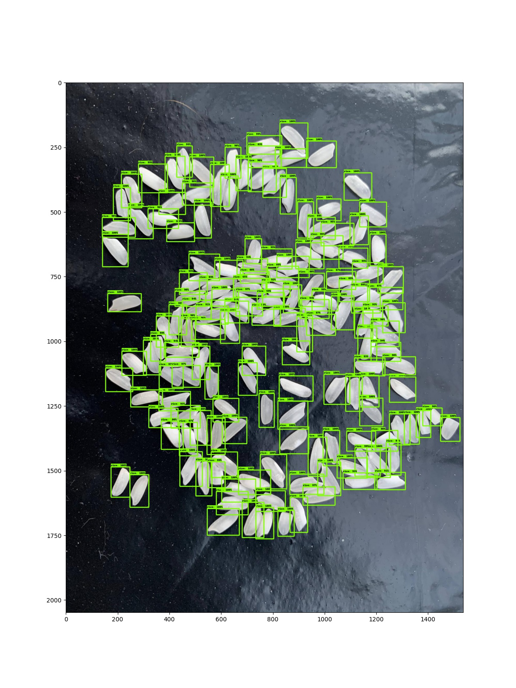
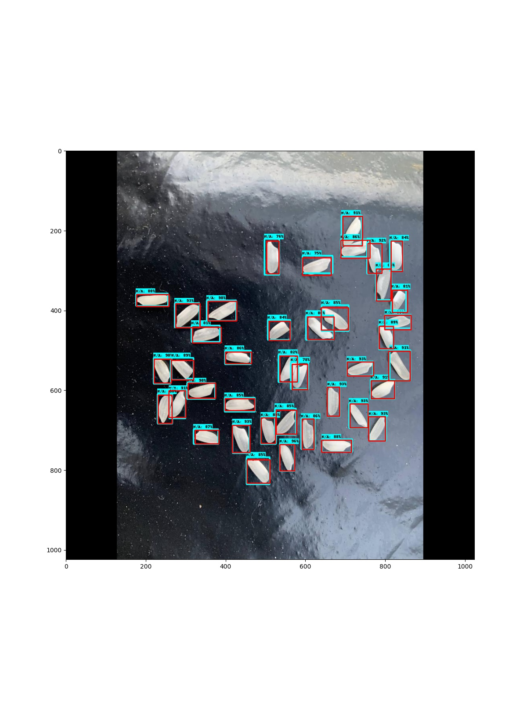

# TinyObjectDetection

### Requirements: Python 3.6

Faster RCNN model trained for Tiny Object Detection, it detects 1-200 rice grains with very high accuracy.
Based on model and code from Tensorflow Models github repository.

My own dataset of rice grains is located in datasets folder.

Feel free to use it, please cite me when doing so.
Will very apprieciate hitting star and watch buttons if u find my work helpful.
### Running detection on trained model
To make it work:
1. Git clone this repository
2. Download trained checkpoint file from: https://drive.google.com/file/d/1L5fxH_xaN6RIy0oRyhVTNc9JYxqYH3YD/view?usp=sharing
3. Put downloaded file in trained_model directory, index file and pipeline config are already there
4. Git clone Tensorflow Models repository into main TinyObjectDetection folder
```
git clone https://github.com/tensorflow/models.git
```
5. (Optional) Create anaconda venv for python 3.6 packages installation
```
conda create -n tiny python=3.6
conda activate tiny
```
6. Install Tensorflow Object Detection API TF2 from forked repository
```
cd models/research
protoc object_detection/protos/*.proto --python_out=.
cp object_detection/packages/tf2/setup.py .
python -m pip install .
```
7. Install Tensorflow=2.2.0
```
pip install -U --pre tensorflow=="2.2.0"
```
8. Update paths in pipeline.config file which is located in trained_model directory
[ABSOLUTE PATH TO FILE] - Put here path to [rice_label_map.pbtxt] file which is located in datasets directory
```
train_input_reader: {
  label_map_path: "[ABSOLUTE PATH TO FILE]"
```
```
eval_input_reader: {
  label_map_path: "[ABSOLUTE PATH TO FILE]"
```
9. Open detect .py file and update paths
```
pipeline_config = '[ABSOLUTE PATH TO pipeline.config file]'
```
```
model_dir = '[ABSOLUTE PATH TO trained_model directory]'
```
```
image_dir = '[ABSOLUTE PATH TO directory with images]'
```
&nbsp; &nbsp; &nbsp; &nbsp; &nbsp; &nbsp;In basic case directory with images is datasets/rice_basic/test or valid
&nbsp; &nbsp; &nbsp; &nbsp; &nbsp; &nbsp;Don't forget to put "/" at the end of path, otherwise os.path.join would throw and error
```
image_path = os.path.join(image_dir, '[NAME OF JPG FILE ALONG WITH EXTENSTION]')
```
10. Run detect .py file, image with detection bounding boxes will appear in main TinyObjectDetection directory as detection .jpg


### IoU Calculation

Program for calculating IoU of all boxes and drawing groundtruth (red) and detections (blue) on image is iou .py
This requires .xml file with coordinates of groundtruth boxes to do correct calculations.

To run it:
1. Make sure u did correctly steps 1-10 for running detection task
2. Open iou .py file and adjust paths (exemplary photo and xml coordinates are located in datasets/iou directory)
```
image_dir = '[Absolute path to iou directory]'
image_path = os.path.join(image_dir, '[Name of image along with extension]')
```
```
file_dir = '[Absolute path to iou directory]'
file_path= os.path.join(file_dir, '[Name of xml file with coords of groundtruth boxes]')
```
3. Run iou .py file, iou calculation will be shown on console, image with boxes will be saved as estimate_iou .jpg

